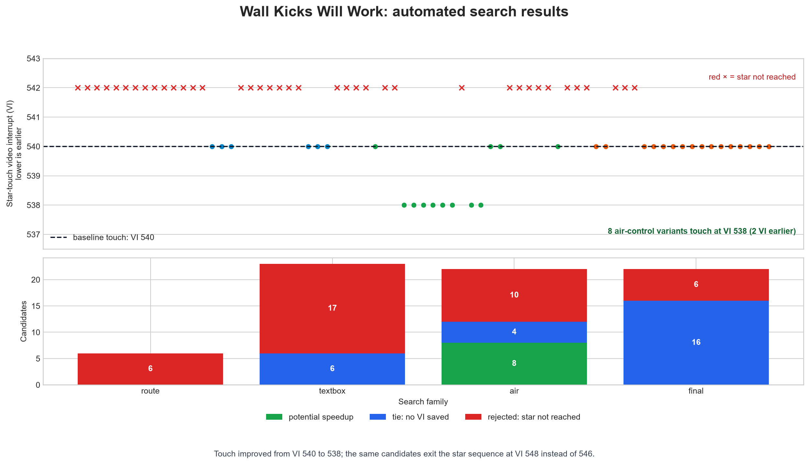
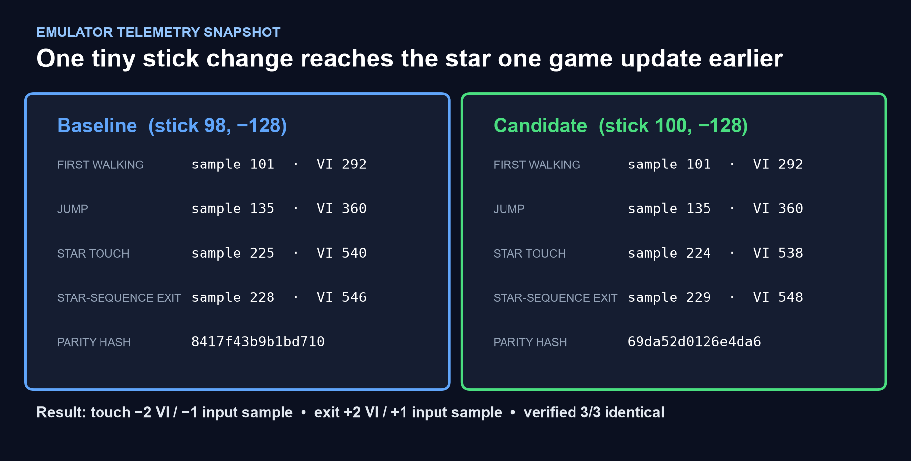

# Super Mario 64 TAS Workshop

## In plain English

This repository lets a computer replay *Super Mario 64* controller inputs
exactly, change a few of them, and measure whether Mario reaches a goal sooner.
It is a laboratory for tool-assisted speedrunning: the game and ROM are not
modified, and every promising emulator result still needs verification on a
real Nintendo 64.

The latest automated experiment tested **73 ideas** on the Wall Kicks Will Work
star. Eight small analog-stick changes made Mario touch the star **one game
update earlier** (input sample 224 instead of 225; VI 538 instead of 540). The
most conservative change, stick X `98 -> 100` during samples 149-201, reproduced
identically in three extra runs. It is promising, not yet a finished record:
Mario exits the star sequence one update later, so the next search must keep the
earlier touch while improving the landing.





Full results: [experiment report](experiments/wall_kicks_next_search/README.md) ·
[machine-readable data](experiments/wall_kicks_next_search/results.json) ·
[research interpretation](notes/research/wall-kicks-speedup-experiment.md)

A local research workspace for **tool-assisted speedruns (TAS)** of *Super Mario 64*: community-standard emulator and diagnostics, published movies, historical IL archives, **n64decomp** source, and study notes from **pannenkoek2012**, **Bismuth**, and **Kaze Emanuar**.

> **Console-first (hard rule):** the finished product must **play on a real Nintendo 64**. Mupen/Whisky are for authoring; retail ROM + hardware-accurate inputs are the target. See [notes/console-first.md](notes/console-first.md).
>
> **Legal:** ROMs are gitignored and never published. Use a dump from a cartridge you own. See [notes/emulators-and-tools.md](notes/emulators-and-tools.md).

---

## Repository layout

```
superMario64-TAS/
├── README.md
├── notes/
│   ├── pannenkoek2012.md     ← engine, ABC, PUs, collision
│   ├── bismuth.md            ← WR explainers, any%/120 routing
│   ├── kaze-emanuar.md       ← performance / engine rewrite analysis
│   ├── console-first.md      ← real N64 is the acceptance target
│   ├── windows-setup.md      ← Windows full automation loop
│   ├── rules-and-decomp.md   ← official rules + decomp TAS insights
│   ├── rules/                ← downloaded TASVideos + SRC rule dumps
│   ├── research/             ← PU/BLJ/squish research (console-safe)
│   ├── emulators-and-tools.md
│   └── tas-catalog.md
├── decomp/
│   ├── README.md
│   ├── sm64/                 ← n64decomp/sm64 (matching rebuild)
│   ├── HackerSM64/           ← romhack-oriented base
│   └── kaze/                 ← Kaze demos & forks
├── tools/
│   ├── windows/              ← setup.ps1, run_mupen.ps1, run_loop.ps1
│   ├── mupen64/              ← Mupen64-rr (TAS emulator)
│   ├── STROOP/
│   ├── research/             ← formula sims + Lua harness
│   └── scripts/
├── tas/                      ← movies & archive
└── roms/                     ← baseroms / built ROMs (gitignored)
```

---

## Quick start

### Windows (primary — full experiment loop)

```powershell
git clone git@github.com:sawaiz/superMario64-TAS.git
cd superMario64-TAS
powershell -ExecutionPolicy Bypass -File tools\windows\setup.ps1
# Place legal ROMs in roms\  (never commit)
powershell -File tools\windows\run_mupen.ps1
```

Full loop (Mupen + Lua harness + log check): **[notes/windows-setup.md](notes/windows-setup.md)**  
Scripts: `tools/windows/setup.ps1`, `run_mupen.ps1`, `run_loop.ps1`  
Harness: `tools/research/harness/tas_harness.lua`

### macOS (optional authoring only)

```bash
./tools/scripts/download_tools.sh   # Mupen64 repack + STROOP
./tools/scripts/download_tases.sh   # TASVideos movies + SM64TASArchive
```

### Emulator: **Mupen64** (Windows native)

| | |
|--|--|
| **Why** | SM64 TAS community standard: `.m64`, rerecording, Lua |
| **Binary** | `tools/mupen64/repack-stable-main/stable/mupen64.exe` |
| **Site** | https://mupen64.com/ |
| **Windows** | `tools\windows\run_mupen.ps1` after `setup.ps1` |

**Loop:** load ROM → drag `tools/research/harness/tas_harness.lua` → play `.m64` → `run_loop.ps1 -CheckOnly`  
Details: [notes/windows-setup.md](notes/windows-setup.md)

**STROOP:** `tools\STROOP\net461\STROOP.exe` — attach to Mupen.

**Console-first:** [console-safety checklist](notes/console-first.md) before claiming a finished movie.

**RTA note:** Mupen64-rr is for **TAS**, not speedrun.com RTA EMU.

### 2b. Decompilation (n64decomp)

```bash
# Matching US rebuild (Docker/Colima on Apple Silicon — native mips brew fails on some macOS)
./tools/scripts/build_decomp_docker.sh

# Trees also present:
#   decomp/sm64          ← https://github.com/n64decomp/sm64
#   decomp/HackerSM64    ← romhack base
#   decomp/kaze/         ← Kaze optimization demos
```

Expected rebuilt US ROM SHA1: `9bef1128717f958171a4afac3ed78ee2bb4e86ce`  
USA baserom MD5: `20b854b239203baf6c961b850a4a51a2`

Kaze performance analysis: [notes/kaze-emanuar.md](notes/kaze-emanuar.md) · decomp map: [decomp/README.md](decomp/README.md)  
**Official rules (TASVideos + speedrun.com) + decomp vs TAS legality:** [notes/rules-and-decomp.md](notes/rules-and-decomp.md)  
**High-value rules-safe research (PU/BLJ/squish/punch tools):** [notes/research/high-value-tas.md](notes/research/high-value-tas.md) · `tools/research/`

### 3. Study existing TASes

| Goal | Start here |
|------|------------|
| Fastest full-game glitchfest | `tas/full-game/1-key/` + [Bismuth notes](notes/bismuth.md) |
| Full completion optimization | `tas/full-game/120-stars/` + archive ILs |
| “Fair” multi-star tech | `tas/full-game/70-stars-no-blj/` |
| Per-star WR files | `tas/archive/SM64TASArchive/Individual Levels/` |
| Engine / ABC theory | [pannenkoek2012 notes](notes/pannenkoek2012.md) |
| Engine performance / 60 FPS hacks | [Kaze Emanuar notes](notes/kaze-emanuar.md) |

Full table: [notes/tas-catalog.md](notes/tas-catalog.md).

---

## What was installed / downloaded

| Component | Source | Local path |
|-----------|--------|------------|
| **Mupen64 stable repack** | [mupen64/repack-stable](https://github.com/mupen64/repack-stable) | `tools/mupen64/` |
| **SM64 Lua Redux + sm64-viz** | Bundled in repack | `.../stable/SM64LuaRedux`, `sm64-viz` |
| **STROOP (vDev)** | [SM64-TAS-ABC/STROOP](https://github.com/SM64-TAS-ABC/STROOP) | `tools/STROOP/` |
| **Whisky** | Homebrew cask | `/Applications/Whisky.app` · bottle `SM64-TAS` |
| **n64decomp/sm64** | [n64decomp/sm64](https://github.com/n64decomp/sm64) | `decomp/sm64/` |
| **HackerSM64** | [HackerN64/HackerSM64](https://github.com/HackerN64/HackerSM64) | `decomp/HackerSM64/` |
| **Kaze demos** | [KazeEmanuar](https://github.com/KazeEmanuar) | `decomp/kaze/` |
| **TASVideos movies** | [tasvideos.org/246G](https://tasvideos.org/246G) | `tas/full-game/` |
| **SM64 TAS Archive** | [TimeTravelPenguin/SM64TASArchive](https://github.com/TimeTravelPenguin/SM64TASArchive) | `tas/archive/SM64TASArchive/` |
| **Colima + Docker** | Homebrew | decomp builds on Apple Silicon |

Optional on macOS for casual N64 play (not TAS movies): `brew install --cask ares-emulator` (opens as **ares.app**).

---

## Learning path (recommended)

1. **Mechanics** — Read [notes/pannenkoek2012.md](notes/pannenkoek2012.md): speed caps, quarter steps, BLJ types, PUs.
2. **Route literacy** — Read [notes/bismuth.md](notes/bismuth.md); watch the any% / 1-key explainer and a 120-star episode.
3. **Tooling** — Frame-advance a castle grounds segment in Mupen; attach STROOP; watch horizontal speed and action.
4. **Imitation** — Playback 1-key `.m64`; re-create a single room (e.g. lobby BLJ) as your own movie.
5. **Improvement** — Pick an IL from the archive older than current community WR; try a 1-frame save.

Community hubs: [Ukikipedia](https://ukikipedia.net), [SM64 TASing & ABC Discord](https://discord.gg/ECskvyF), [Mupen64 Discord](https://discord.gg/hFANcme32k), [TASVideos SM64](https://tasvideos.org/246G).

---

## Ideas for improvements and fixes

### A. Tooling / repo engineering

| Idea | Why it matters | Difficulty |
|------|----------------|------------|
| **`.m64` metadata indexer** | Parse headers (ROM name, rerecord count, authors) into `tas/INDEX.md` or JSON | Easy |
| **MupenSharp or Python m64 parser** | Diff two movies frame-by-frame; find first input divergence | Medium |
| **Automated download CI** | GitHub Action re-pulls TASVideos + archive on schedule | Easy |
| **Git LFS or submodule for archive** | Keep repo clone small; large savestates out of main history | Easy |
| **Wine/Whisky launch scripts** | One-command `./tools/scripts/run_mupen.sh` on macOS | Medium |
| **Dockerized Windows TAS stack** | Reproducible Mupen+STROOP for collaborators | Hard |
| **ROM hash gate** | Script refuses to start unless MD5 matches USA/J expected | Easy |
| **BizHawk optional download** | Playback `.bk2` without manual hunt | Easy |

### B. TAS improvement research (game / movies)

| Idea | Angle |
|------|--------|
| **Segment re-sync of 1-key on latest Mupen** | Emulator revisions change lag; re-verify movie, document desync frames |
| **120-star IL → full-game merge audit** | Compare archive IL WRs to full-game 120 segments; list stars still “soft” |
| **Lag-centric camera routes** | Revisit castle and RR with modern lag understanding (object unload / camera modes) |
| **Pause-BLJ vs non-pause trade studies** | Script measure: time saved vs menu overhead per location |
| **J vs U textbox / lag maps** | Spreadsheet of stage entry costs; decide optimal region per category |
| **BitFS / BitDW micro-improvements** | Still historically fertile for frame saves in low% |
| **No-BLJ 70 star modernization** | Apply post-2012 movement tech that isn’t BLJ |
| **All-trees / joke categories** | Low competition → easy publications, good practice |
| **Console verification pipeline** | For any new movie aiming at TASVideos stars: dump → EverDrive / approved cart setup |

### C. Technique R&D (pannenkoek / ABC adjacent)

| Idea | Notes |
|------|--------|
| **0 A-press star ports to full ABC** | Track Ukikipedia ABC status; reproduce in Mupen with STROOP logs |
| **PU lattice calculator** | Given position + speed, predict PU index and landing cell |
| **Scuttlebug / HOLP lab maps** | Savestate library per clone setup for common stars |
| **Hyperspeed float edge cases** | Document when speed hits Inf / NaN and recovery |
| **Quarter-step visualizer** | Lua: draw 4 substep positions per frame (SM64 Lua Redux extension) |

### D. Documentation / education fixes

| Idea | Notes |
|------|--------|
| **Timestamped breakdown of 1-key `.m64`** | Mirror Bismuth chapters with frame numbers |
| **Glossary** | BLJ, HSW, PU, QPU, HOLP, VSC, dust frames, nisflip, … |
| **“First TAS” tutorial branch** | Minimal BoB star with commented inputs |
| **Desync troubleshooting guide** | Plugin, counter factor, ROM hash, savestate version |
| **Credit / license PASS** | Ensure redistributed movies follow TASVideos + archive rules |

### E. Known pitfalls to “fix” in your workflow

1. **Wrong region ROM** → instant desync. Always match movie (J vs U).
2. **Wrong plugin / RSP / graphics** → lag desync on long movies.
3. **Confusing RTA rules with TAS tools** → Mupen-rr is not an RTA free pass.
4. **Editing movies without rerecord discipline** → keep WIP folders and changelogs.
5. **Ignoring lag** — a faster-looking segment can lose frames to camera/objects.
6. **Dust frames on dive recoveries** — free frames if you press A/B one frame late.
7. **Nested git in archive** — re-download script strips `.git` so this repo stays one project; contribute upstream separately.

### F. Stretch goals

- Train a **search bot** (similar in spirit to past SM64 bots) for short IL segments with a clear reward (star grab frame).
- Rebuild **sm64-port** or decomp-based tools for deterministic experiments (note: different from N64 Mupen movies; not drop-in for TASVideos N64).
- Publish a **TAScomp** entry using this tree’s hygiene (ROM hash, script versions, input comments).

---

## Contributing back upstream

Improvements to shared resources belong in their homes:

- New / better IL or full-game `.m64` → [SM64TASArchive](https://github.com/TimeTravelPenguin/SM64TASArchive) or TASVideos submission
- STROOP features/bugs → [STROOP issues](https://github.com/SM64-TAS-ABC/STROOP)
- Mupen TAS features → [mupen64-rr-lua](https://github.com/mupen64/mupen64-rr-lua) / Mupen Discord
- Wiki facts → [Ukikipedia](https://ukikipedia.net)

---

## Credits

- **Mupen64** developers and repack maintainers  
- **STROOP** — SM64-TAS-ABC  
- **TASVideos** publishers and SM64 TAS authors (mkdasher, snark, sonicpacker, SilentSlayers, ToT, Tyler_Kehne, Superdavo0001, IsaacA, and many more)  
- **TimeTravelPenguin** — SM64 TAS Archive  
- **pannenkoek2012** — engine education & ABC  
- **Bismuth** — accessible WR / TAS explainers  
- **Ukikipedia** contributors  

This workshop is an independent study repo, not affiliated with Nintendo.

---

## License

- **Your notes and scripts** in this repo: use freely unless marked otherwise.  
- **Third-party tools and movies**: retain their original licenses and attribution requirements. Do not redistribute ROMs.
