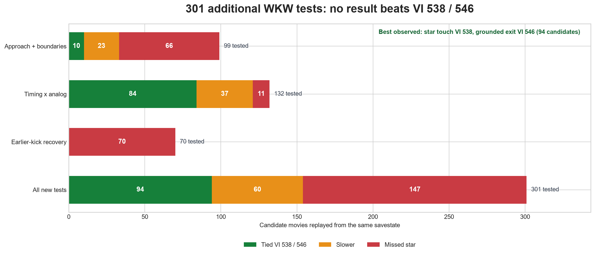
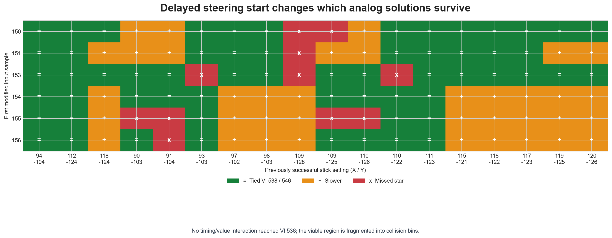
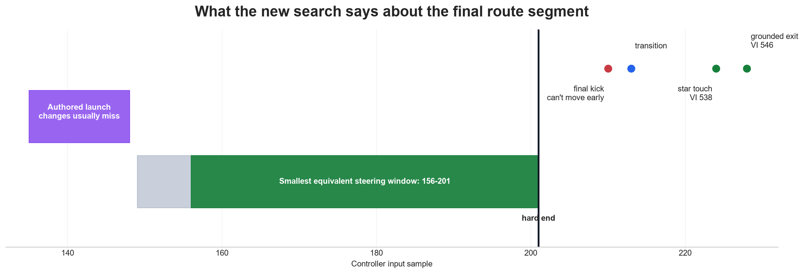

# Wall Kicks Will Work: approach and action search

## Outcome

Three new headless Mupen batches tested **301 candidates** on top of the verified
`(94, -104)` route. None improved its star touch at VI 538 or grounded exit at
VI 546. All transient emulator timeouts were retried, so the result set has no
missing outcomes.

| Batch | Candidates | VI 538 / 546 ties | Slower | Missed star |
|---|---:|---:|---:|---:|
| Approach and window boundaries | 99 | 10 | 23 | 66 |
| Delayed-start × proven analog values | 132 | 84 | 37 | 11 |
| Earlier final-kick recovery | 70 | 0 | 0 | 70 |
| **Total** | **301** | **94** | **60** | **147** |



Machine-readable results:

- [approach and window results](results.json)
- [timing/value interaction results](interaction-results.json)
- [earlier-kick recovery results](kick-recovery-results.json)

## What was learned

- The winning steering window can begin at sample **156** rather than 149 and
  still reach touch VI 538 / exit VI 546. Its end is not flexible: every tested
  end other than sample 201 lost the early touch.
- The long-window solution occupies several disconnected analog-stick regions.
  Crossing six neutral delayed starts with all 18 previously proven VI 538/546
  values produced many ties but no VI 536 touch.



- Small changes to the authored launch inputs at samples 135-148 are usually
  route-breaking. Four narrow Y-only suffix edits tie the seed.
- Moving either early run-up kick, the sample-134 jump, or the final jump kick by
  one sample breaks this route. Retuning 70 pre-kick, post-kick, held-button, and
  transition variants did not recover the star after the final kick was advanced.

This is strong evidence that another frame will require a different action or
collision sequence, not another uniform analog value near the current route.
SM64 evaluates ground and air movement through quarter steps, so a structural
search should score intermediate collision state rather than only success/fail.
The TASVideos mechanics notes also emphasize first-possible-frame jump kicks as
a speed-preserving technique; this route already appears timing-tight under
one-sample perturbation.



## Most promising next experiments

1. **State-aware beam search from the launch.** Extend the harness with distance
   to the star, vertical gap, wall/floor triangle, action timer, and intended yaw.
   Branch only the next 2-4 samples and keep the best distinct states. This can
   re-optimize downstream inputs after an action change instead of testing that
   change against an incompatible fixed tail.
2. **Alternative movement action into the long fall.** Search a slide kick,
   different landing-kick cadence, or a different jump type before sample 135.
   This is higher risk but can change vertical phase enough to make VI 536
   geometrically possible.
3. **Collision-targeted two-phase steering.** Once wall/floor triangle and star
   distance are logged, optimize separate approach and contact phases using a
   continuous score. The current binary star result leaves near misses
   indistinguishable from route-breaking misses.
4. **Camera/lag sweep.** Test legal C-button/camera states over the expensive
   geometry segment and score VI count separately from input samples. This will
   not change Mario's nominal 30 Hz physics but could save a render VI if the
   original view incurs avoidable lag on console.
5. **State-matched archive crossover.** Align archived USA/Japan routes by
   position, horizontal speed, vertical speed, and yaw before transplanting a
   short suffix. Raw sample-aligned transplants already failed.

References: [SM64 decompilation](https://github.com/n64decomp/sm64),
[TASVideos SM64 mechanics](https://tasvideos.org/GameResources/N64/SuperMario64),
and [TASVideos discussion of first-frame jump kicks](https://tasvideos.org/Forum/Posts/305099).

## Reproduce

```powershell
python tools\research\wkw_approach_search.py
python tools\research\wkw_approach_search.py --interaction-only
python tools\research\wkw_approach_search.py --kick-recovery-only
python tools\research\plot_approach_results.py
```

Use `--retry-errors --timeout 35` with the corresponding mode if a transient
emulator timeout occurs. Candidate movies and savestates are generated locally
and ignored by Git.
