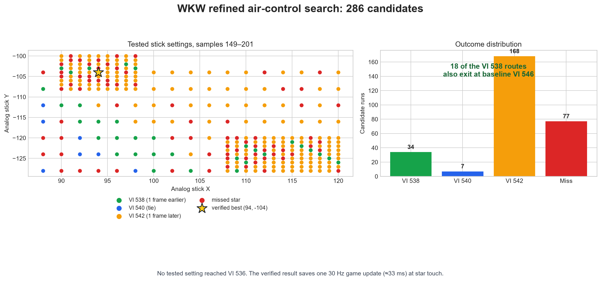
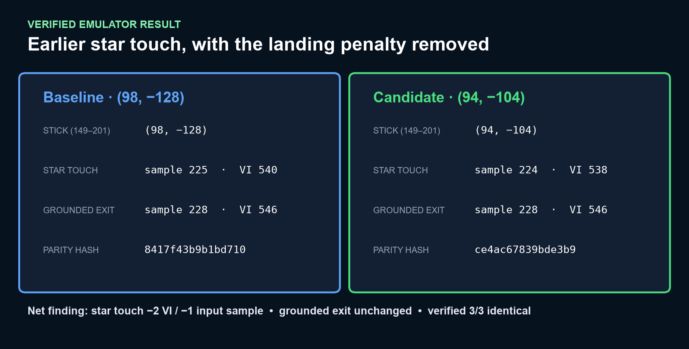

# Wall Kicks Will Work: refined touch search

## Outcome

This continuation tested 286 coarse and fine analog-stick settings on top of
the original route. The verified best candidate applies `(94, -104)` during
input samples 149-201 instead of the baseline `(98, -128)`.

| Metric | Baseline | Candidate | Change |
|---|---:|---:|---:|
| Star-touch sample | 225 | 224 | **-1** |
| Star-touch VI | 540 | 538 | **-2 VI / one 30 Hz update** |
| Grounded-exit sample | 228 | 228 | 0 |
| Grounded-exit VI | 546 | 546 | 0 |

The candidate replayed identically three times with parity hash
`ce4ac67839bde3b9`. It removes the landing penalty found in the first expanded
search while retaining its earlier star touch.

[Watch the verified H.264/AAC gameplay render](wkw-speedup-x94-y-104.mp4).





## Search limits

- 34 settings touched at VI 538.
- 18 of those also reached the grounded exit at baseline VI 546.
- 7 tied the original VI 540 touch.
- 168 touched later at VI 542.
- 77 missed the star.
- No tested setting touched at VI 536.
- All three emulator timeouts were retried successfully, leaving no missing
  outcomes in the search grid.

The vertical spacing at sample 223 makes a second saved game update unlikely
without changing the jump-kick schedule. An 86-candidate layered landing search
tested kick timing, button transitions, counter-steering, and shorter edit
windows. Moving the kick was route-breaking; horizontal-only changes could not
produce a VI 536 touch. See the [landing-search data](../wall_kicks_landing_search/results.json).

## Interpretation

For an individual-level timing endpoint at star interaction, this is an
emulator-positive one-frame improvement: two 60 Hz VIs, or approximately 33 ms.
The unchanged grounded exit also makes the candidate safer for workflows that
continue measuring through the post-grab landing. It is not a publication-ready
record until replayed on real N64 hardware under the repository's console-first
policy.

## Reproduce

```powershell
python tools\research\wkw_touch_search.py
python tools\research\wkw_touch_search.py --refine-only
python tools\research\wkw_touch_search.py --retry-errors
python tools\research\wkw_touch_search.py --verify-only
python tools\research\plot_speedup_results.py
```

Generated candidate movies and savestates are gitignored. The committed
[results.json](results.json) retains timings and parity hashes for all runs.
