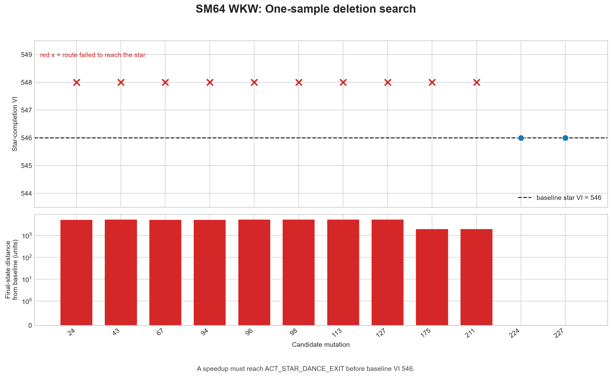
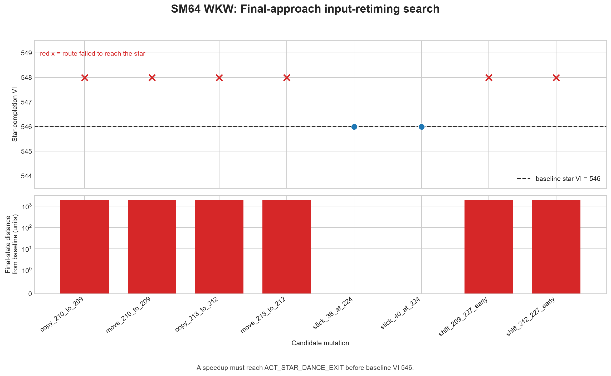

# Wall Kicks Will Work: one-frame speedup search

## Latest outcome

An expanded 73-candidate search found eight deterministic **star-touch**
improvements. The best conservative seed changes stick X from 98 to 100 over
samples 149-201. It touches the star at sample 224 / VI 538 versus baseline
sample 225 / VI 540, and repeated identically three times.

It is not yet an end-to-end improvement: the candidate reaches grounded
`ACT_STAR_DANCE_EXIT` at VI 548, two VIs later than the baseline's VI 546.
The next search should optimize the landing while retaining the earlier touch.


Detailed data and the full idea list are in the
[expanded experiment report](../../experiments/wall_kicks_next_search/README.md).

## Earlier bounded-search outcome

No speedup was found in the original 20 one-sample mutations. The verified baseline
reaches `ACT_STAR_DANCE_EXIT` at input sample **228**, movie VI **546**. Of 20
candidate edits, 16 failed to collect the star and four completed on the same
VI as the baseline. None completed earlier.

This is a negative result for the tested neighborhood, not proof that the IL is
globally optimal.

## Experiment design

- Movie: archive `Wall Kicks Will Work (U).m64`, 6.10 s with textboxes.
- ROM: retail USA `.z64`, MD5 `20b854b239203baf6c961b850a4a51a2`.
- Emulator: repository Mupen64 repack, invoked only through its CLI.
- Start state: the archive movie's matching `.st` snapshot.
- Instrumentation: `tas_harness.lua`, extended to log `emu.framecount()` as
  movie VI alongside input sample, action, speed, position, and timer.
- Execution: parity checking every ten samples at ultra-fast-forward; each
  candidate runs from the same snapshot.
- Original acceptance: a candidate had to reach action `0x00001302`
  (`ACT_STAR_DANCE_EXIT`) on a VI lower than 546.

Movie VI is the timing metric. The expanded search separately records airborne
star touch (`ACT_FALL_AFTER_STAR_GRAB`, `0x00001904`) and grounded star-sequence
exit (`ACT_STAR_DANCE_EXIT`, `0x00001302`). An earlier controller-sample index
alone is not a speedup because input polls and VIs are not interchangeable.

## Search 1: remove one input sample

Twelve deletions targeted boundaries and interior points of neutral or repeated
input runs before star collection. Ten candidates desynced before collecting
the star. Deleting sample 224 or 227 still completed, but both reached the star
at sample 228 / VI 546: no time saved.



Detailed table and machine-readable data:

- [frame-deletion table](../../experiments/wall_kicks_frame_delete/README.md)
- [frame-deletion JSON](../../experiments/wall_kicks_frame_delete/results.json)

## Search 2: retime final-approach inputs

Eight variants targeted samples 209-227: moving or duplicating the two discrete
button transitions, shifting final input blocks one sample earlier, and applying
the later analog values at sample 224. Six variants failed to collect the star.
The two analog variants completed but tied baseline VI 546.



Detailed table and machine-readable data:

- [retiming table](../../experiments/wall_kicks_retime/README.md)
- [retiming JSON](../../experiments/wall_kicks_retime/results.json)

## Interpretation

The route is highly sensitive to the earlier button transitions: moving them by
one sample changes the movement state enough to miss the star. The final analog
values have some tolerance, but changing them does not move the completion VI.
Simple deletion or one-sample retiming is therefore not a productive speedup
path in this tested interval.

That proposed analog sweep produced the earlier-touch seed described above.
The strongest follow-up is a two-phase trajectory sweep: preserve the successful
air control long enough to touch at VI 538, then counter-steer so Mario reaches
the grounded exit no later than VI 546. Any emulator-positive result must still
pass the repository's console-first verification before being claimed as a
finished TAS improvement.

## Reproduce

From the repository root:

```powershell
python tools\research\speedup_search.py
python tools\research\speedup_retime.py
python tools\research\wkw_next_search.py --stages route textbox air final
python tools\research\wkw_next_search.py --stages verify --verify-runs 3
python tools\research\plot_speedup_results.py
```

Candidate `.m64` and `.st` files are local generated artifacts and are ignored
by Git. Results, reports, and graphs are retained.
